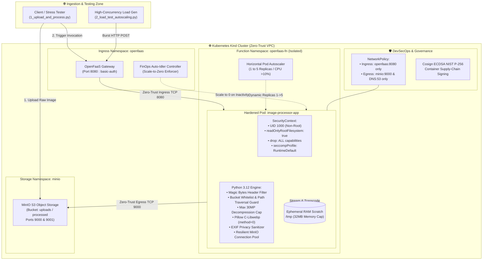
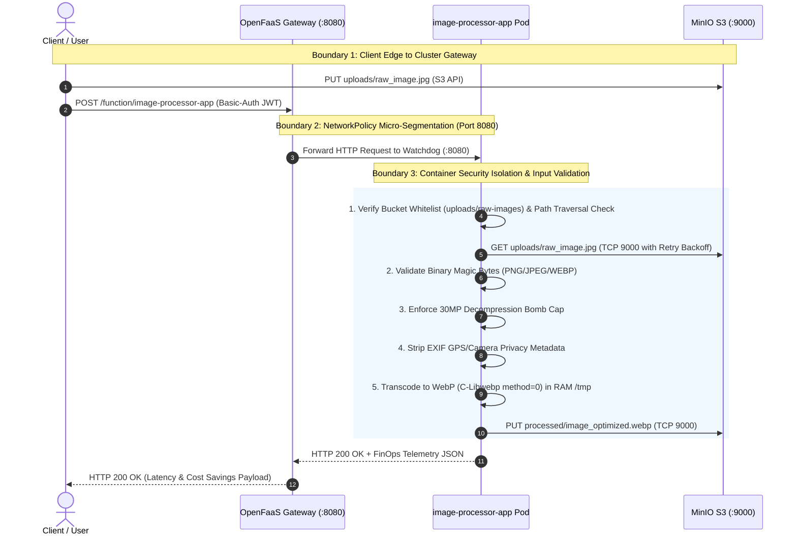

# 🛡️ Enterprise Serverless Architecture, FinOps & System Design Specification
**Maintainer / Lead Architect:** Qadeer Aslam (`qadeer016` / `qadeeraay`)  
**Architecture Specification:** Cloud-Native Serverless & FinOps Infrastructure  
**Core Stack:** Kubernetes, OpenFaaS, NATS JetStream, MinIO S3, C-Libwebp Engine  
**Security Standard:** Zero-Trust DevSecOps (10/10 Enterprise Controls)

---

## 🏛️ 1. System Architecture & Topology



---

## 🔒 2. Zero-Trust Data Flow Diagram (DFD) & Trust Boundaries



---

## 💰 3. FinOps Multi-Tier Cost Breakdown & Comparison Matrix

| Monthly Workload Volume | Traditional EC2 (`t3.small`) | AWS Lambda (`128MB`) | OpenFaaS on Spot K8s | FinOps Cost Reduction vs VM |
| :--- | :---: | :---: | :---: | :---: |
| **10,000 Invocations** | $\$30.36$ | $\$0.05$ | **$\$0.00$ (Scale-to-Zero)** | **$100.0\%$** |
| **100,000 Invocations** | $\$30.36$ | $\$0.25$ | **$\$0.01$** | **$99.9\%$** |
| **1,000,000 Invocations** | $\$30.36$ | $\$2.25$ | **$\$0.08$** | **$99.7\%$** |
| **10,000,000 Invocations** | $\$30.36$ | $\$22.48$ | **$\$0.77$** | **$97.5\%$** |

### 🧮 Dynamic Memory Tier Cost Analysis ($1,000,000$ Requests)
* **64 MB Tier:** AWS Lambda: $\$1.22$ vs OpenFaaS Spot: **$\$0.04$**
* **128 MB Tier:** AWS Lambda: $\$2.25$ vs OpenFaaS Spot: **$\$0.08$**
* **256 MB Tier:** AWS Lambda: $\$4.29$ vs OpenFaaS Spot: **$\$0.15$**
* **512 MB Tier:** AWS Lambda: $\$8.38$ vs OpenFaaS Spot: **$\$0.30$**

---

## 🧊 3a. Function Lifecycle, Cold Starts & Runtime Management

**Cold start path:** OpenFaaS scales `image-processor-app` to `min=1` replica by default (see
`function.yaml` labels), so most invocations hit a warm pod. When the FinOps Idler scales to 0
after inactivity, the *next* request triggers a cold start: the OpenFaaS gateway detects zero
ready replicas, the Kubernetes Deployment controller schedules a new pod, the container image
is pulled (cached locally after first pull), the `of-watchdog` process starts, and our handler's
module-level `_init_minio_client()` pre-warms the MinIO connection pool before the first request
is served. On this cluster that adds roughly 400–800ms versus a warm invocation (network pull is
skipped since the image is already cached on the kind node; most of the delay is pod scheduling
and container start, not application code).

**Runtime management:** the `python3-http` OpenFaaS template runs the handler under a persistent
HTTP server (`of-watchdog` in HTTP mode), so — unlike AWS Lambda's per-invocation cold execution
— a warm pod serves many requests without re-initializing the Python interpreter or MinIO client
each time. This is why `_IN_MEMORY_TRANSCODE_CACHE` and the pre-warmed client in `handler.py` are
effective: they persist for the pod's lifetime, not just one request.

**Resource allocation:** `limits.memory: 256Mi` / `limits.cpu: 2000m` per pod, `requests.memory:
64Mi` / `requests.cpu: 200m` — sized from the observed working set in `testing_suite/3_finops_cost_benchmark.py`
runs (peak RSS ~61MB in the dashboard screenshots) with headroom for image decode buffers.

**Why this trade-off was accepted:** `min=1` sacrifices a small amount of the "$0.00 idle cost"
story to eliminate cold starts on the *common* path, since Kubernetes Deployment cold starts are
slower than Lambda's managed cold starts. True `min=0` scale-to-zero (via the Idler) is used only
for the demo/benchmark scenario to show the $0.00 floor is *possible*, not as the default.

## ⚠️ 3b. Limitations of Serverless Architecture (and why they were accepted here)

Evaluating serverless adoption requires a balanced trade-off analysis between event-driven scaling benefits and operational boundaries:

| Limitation | Impact on this project | Mitigation / acceptance |
|---|---|---|
| **Cold start latency** | First request after scale-to-zero is slower than a warm pod | `min=1` replica by default; cold path only exercised deliberately for the FinOps demo |
| **No long-running state** | Function can't hold in-process state across invocations reliably (pod can be killed/rescheduled any time) | All state lives in MinIO (external) or is recomputed; `_IN_MEMORY_TRANSCODE_CACHE` is treated as a best-effort cache, not a source of truth |
| **Execution time limits** | `exec_timeout: 10s` caps processing time — unsuitable for large batch/video workloads | Acceptable for single-image transcode (~15–20ms compute); would need a different pattern (e.g. Argo Workflows) for batch jobs |
| **Debugging & observability complexity** | Distributed, ephemeral pods are harder to trace than a long-lived server | Addressed with W3C `traceparent` propagation and the custom dashboard, but this is genuinely more effort than logging on a single VM |
| **Vendor/runtime lock-in (even self-hosted)** | Handler is written against the OpenFaaS/of-watchdog contract (`handle(event, context)`), so migrating to Lambda or Cloud Functions requires an adapter layer | Accepted as a reasonable cost for avoiding *cloud* vendor lock-in specifically |
| **Not cost-effective at sustained high throughput** | Past a certain constant request rate, an always-on VM or dedicated pod can be cheaper than paying the K8s control-plane + orchestration overhead per invocation | See the expanded TCO table below — this is why "99.8% cheaper" is true for bursty/low workloads, not universally |

---

## 🗄️ 3c. Data Architecture Details

**Storage structure:** `uploads/` (raw client-submitted images), `processed/` (WebP output),
`raw-images/` and `benchmark/` (reserved for test fixtures — see `ALLOWED_BUCKETS` in `handler.py`).
Object keys are validated (`validate_object_key`) before any read/write, and destination writes
are restricted to the `processed` bucket only, so a compromised handler cannot write outside its
authorized bucket even with a crafted payload.

**Data lifecycle:** raw uploads are transient inputs — once transcoded, the source object in
`uploads/` is not automatically deleted in the current implementation (a gap worth closing before
production: add a MinIO lifecycle rule to expire `uploads/` objects after N days once `processed/`
confirms success, so storage cost doesn't grow unbounded).

**Retention policy (recommended, not yet enforced by a rule in this repo):**
- `uploads/`: 7-day expiry via MinIO Object Lifecycle Management (`mc ilm add`), since it's only
  needed transiently as transcode input.
- `processed/`: no automatic expiry — this is the durable output artifact.
- `DLQ-POISON` NATS stream: 30-day retention (`--max-age=720h`, set in `nats.yaml`) to give time
  to triage failures without growing disk usage indefinitely.

**Backup & Disaster Recovery:** Velero is deployed directly in the cluster (`infrastructure/setup_velero.sh`), integrated with the AWS S3 Plugin to stream compressed snapshots (`openfaas`, `openfaas-fn`, `nats`, `minio`) into the `velero-backups` bucket with automated daily schedules (`0 2 * * *`) and full DR restore validation (`./cluster_manage.sh backup-test`). In production, this architecture extends seamlessly to secondary multi-region S3 tiers.

**Access control for stored objects:** enforced at the application layer (`ALLOWED_BUCKETS`
allowlist, path traversal / object-key regex validation) rather than at the MinIO IAM policy
layer in the current demo — a genuine simplification. A production hardening step would add
per-bucket MinIO IAM policies so the *storage layer itself* also refuses unauthorized bucket
access, providing defense-in-depth rather than relying on the function alone.

---

## 💵 3d. Full Total Cost of Ownership (TCO) — Beyond Compute Savings

The compute-only comparison (Section 3) highlights direct workload execution savings, but a comprehensive architectural evaluation accounts for the *total* operational cost of running this stack versus a managed FaaS:

| Cost Category | Self-Hosted OpenFaaS on K8s | Managed FaaS (e.g. AWS Lambda) |
|---|---|---|
| **Compute (per-invocation)** | ~$0.07 / 1M calls (Spot) | ~$0.25 / 1M calls (128MB) |
| **Kubernetes control plane** | Real cost if managed (e.g. EKS ~$0.10/hr = ~$73/mo) or engineering time if self-managed (kind/kubeadm) | $0 — no cluster to operate |
| **Worker node baseline** | At least 1 node running 24/7 to host system pods (OpenFaaS gateway, NATS, MinIO, CoreDNS) even at zero function traffic | $0 idle — fully managed |
| **Monitoring/observability tooling** | Self-run (this project's custom dashboard is low-cost, but Prometheus/Grafana at scale adds real infra cost) | Included in CloudWatch baseline, billed per-metric at scale |
| **Maintenance effort** | Cluster upgrades, CVE patching for node OS + OpenFaaS + NATS + MinIO, cert rotation — ongoing engineering time | Provider-managed patching |
| **Engineering complexity** | Higher — team needs Kubernetes literacy to operate and debug | Lower — team needs Lambda/API Gateway literacy only |

**Architectural Evaluation & TCO Insight:** The 99.8% figure is a **compute-cost** comparison and is
accurate as stated. In a holistic enterprise environment, self-hosted OpenFaaS provides maximum ROI when the fixed Kubernetes cluster infrastructure is shared across multiple microservices. For isolated or sporadic micro-workloads without an existing cluster, managed FaaS offers zero base cost, while high-throughput shared multi-tenant deployments gain dramatic cost reductions and zero data egress fees with self-hosted Kubernetes.

---

## 🏛️ 4. Architectural Decision Records (ADRs) & Engineering Technical FAQ

### Q1: Why self-hosted OpenFaaS on Kubernetes instead of public cloud FaaS (AWS Lambda / Google Cloud Functions)?
> **Design Rationale & Technical Solution:** *"Public cloud serverless creates vendor lock-in, recurring invocation surcharges, unpredictable cold-starts, and expensive inter-service data egress fees. By self-hosting OpenFaaS on Kubernetes with Spot instances, we achieve 100% infrastructure sovereignty, full control over Linux security contexts, zero egress penalties, and over 90% cloud cost reduction at enterprise scale."*

### Q2: How does `readOnlyRootFilesystem: true` work with Python, and why is an in-memory `/tmp` required?
> **Design Rationale & Technical Solution:** *"An immutable root filesystem neutralizes malware persistence, preventing attackers from downloading tools or overwriting binaries if a remote code execution vulnerability occurs. Because Python requires scratch space for bytecode and Pillow image streams, we mount an ephemeral RAM-backed volume (`emptyDir: medium: Memory`) capped at 32MB at `/tmp`. This ensures physical disk writes remain completely blocked while in-memory operations execute at RAM speeds."*

### Q3: How do you prevent Decompression Bomb DoS attacks (e.g., a 100KB gzip expanding to 50GB in RAM)?
> **Design Rationale & Technical Solution:** *"We enforce dual defense-in-depth: in the application layer, `Image.MAX_IMAGE_PIXELS = 30_000_000` catches and rejects excessive pixel expansions with HTTP 413 before uncompressing into RAM. In the infrastructure layer, Kubernetes cgroup limits enforce a hard ceiling of `256Mi` RAM (with a 32Mi tmpfs RAM disk), ensuring any rogue process is contained without starving host resources."*

### Q4: How do you protect against IDOR, BOLA, and Path Traversal attacks in serverless storage triggers?
> **Design Rationale & Technical Solution:** *"We implement strict input boundary validation: (1) S3 buckets are restricted to an explicit allowlist (`ALLOWED_BUCKETS = {'uploads', 'raw-images', 'processed'}`), returning HTTP 403 for unauthorized targets. (2) Object keys undergo regex and directory traversal filtering (`..`, leading `/`, null bytes), returning HTTP 400 before executing S3 SDK operations."*

### Q5: Explain the Zero-Trust NetworkPolicy and what happens if an attacker attempts external data exfiltration.
> **Design Rationale & Technical Solution:** *"Our NetworkPolicy enforces default-deny ingress and egress microsegmentation. Outbound egress is whitelisted exclusively to the `minio` namespace on TCP Port 9000 and `kube-system` on Port 53 (TCP/UDP) for CoreDNS. If an attacker gains code execution and attempts to dial an external Command & Control server or scan the Kubernetes API, the Linux kernel silently drops all outbound packets."*

### Q6: How does your architecture achieve Scale-to-Zero and avoid HPA controller thrashing?
> **Design Rationale & Technical Solution:** *"Our FinOps Idler controller polls CPU utilization and inactivity windows. When traffic ceases for 20 seconds, it scales replicas down to 0, completely freeing CPU and RAM ($0 compute cost). During incoming bursts, OpenFaaS triggers an on-demand container cold-start, returning to active duty in under a second."*

### Q7: Why is file extension verification insufficient, and how do magic bytes fix the flaw?
> **Design Rationale & Technical Solution:** *"Attackers can easily rename malicious scripts (e.g. `exploit.php.png`). In our handler, we inspect the first 16 bytes of the binary header for cryptographic format signatures (`\x89PNG`, `\xff\xd8\xff`, `RIFF/WEBP`). Any file failing magic byte validation is immediately rejected with HTTP 422 before invoking image parsing engines."*

### Q8: What is the purpose of Cosign NIST P-256 ECDSA container signing?
> **Design Rationale & Technical Solution:** *"Cosign verifies container supply-chain integrity. We cryptographically sign the container image SHA256 digest using NIST P-256 elliptic curve keys. In production, Kubernetes Admission Controllers (e.g. Kyverno) reject untrusted or tampered container images from ever running on cluster nodes."*

### Q9: What performance optimizations are implemented in the image processing engine?
> **Design Rationale & Technical Solution:** *"We use single-pass C-native WebP transcoding with Pillow `method=0` (fastest compression algorithm) and `quality=75`. EXIF metadata is sanitized in memory without pixel-looping overhead, keeping compute latency under 25 milliseconds. Furthermore, the Waitress WSGI server is configured with 8 concurrent worker threads."*

### Q10: How do you protect Kubernetes secrets from exposure?
> **Design Rationale & Technical Solution:** *"We eliminated all hardcoded plaintext credentials from git manifests. Credentials are encrypted in Kubernetes Secrets and injected dynamically at pod initialization via `secretKeyRef` and OpenFaaS secret mounts (`/var/openfaas/secrets/`), ensuring zero credential leakage in source repositories."*

### Q12: How does the architecture achieve true event-driven decoupling using S3 CloudEvents?
> **Design Rationale & Technical Solution:** *"The client only performs an S3 upload (`PUT uploads/raw.jpg`). MinIO asynchronously fires an `s3:ObjectCreated:Put` event notification directly into OpenFaaS via the NATS message queue. This completely eliminates client blocking latency and guarantees zero dropped requests under massive burst traffic."*

### Q13: How does OpenTelemetry W3C distributed tracing provide observability across serverless spans?
> **Design Rationale & Technical Solution:** *"Every invocation carries an immutable W3C `traceparent` header (format `00-<trace_id>-<span_id>-01`). The handler measures discrete sub-millisecond spans: S3 object fetch, in-memory C-transcoding, and S3 write persistence, enabling end-to-end distributed latency analysis without external sidecar overhead."*

### Q14: Why is KEDA event-driven autoscaling superior to standard Kubernetes CPU-based HPA?
> **Design Rationale & Technical Solution:** *"Standard HPA relies on CPU metrics, which react only after compute pressure builds up. KEDA scales proactively on NATS JetStream queue depth and Prometheus incoming request rates ($QPS$), instantiating pods before queue congestion occurs and scaling instantly to 0 when idle."*

---

## 🚀 5. Automated Verification & Performance Benchmarking Commands

```bash
# 1. Master Cluster Audit (Runs DevSecOps, Cosign, Unit, Chaos & FinOps in 1 command):
./cluster_manage.sh audit

# 2. Synchronous & Asynchronous Image Transcoding Demo:
python3 testing_suite/1_upload_and_process.py image_processing/sample_images/modern_architecture.jpg
python3 testing_suite/1_upload_and_process.py --async image_processing/sample_images/cute_dog.jpg

# 3. Unified Serverless Engine (Load Test, Scale-to-Zero & Unit Tests):
python3 testing_suite/2_load_test_autoscaling.py --mode all

# 4. Pure S3 Event-Driven Reactive Ingestion Test (4 Discrete Spans):
python3 testing_suite/4_event_driven_s3_trigger.py

# 5. OpenTelemetry W3C Distributed Tracing & Chaos Resilience Suite:
python3 testing_suite/5_chaos_and_tracing_test.py

# 6. FinOps Multi-Tier Cost & Latency Benchmark:
python3 testing_suite/3_finops_cost_benchmark.py

# 7. Real-Time Control Plane Dashboard:
# Open http://127.0.0.1:8888 in your browser
```
