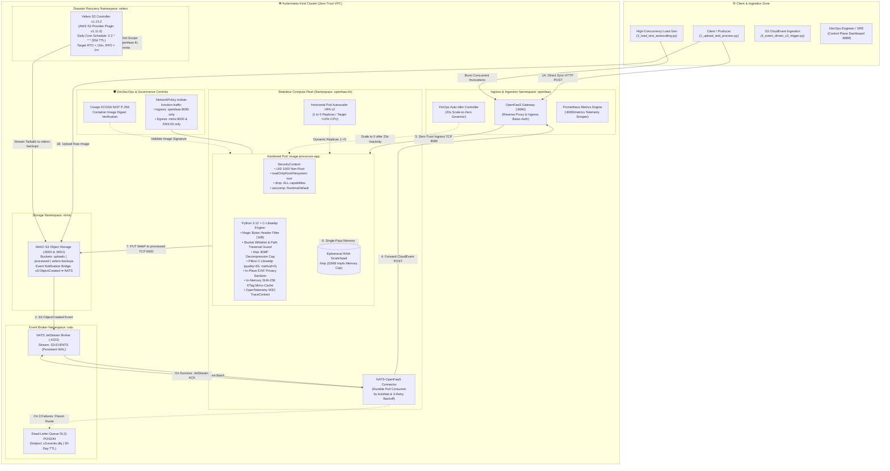
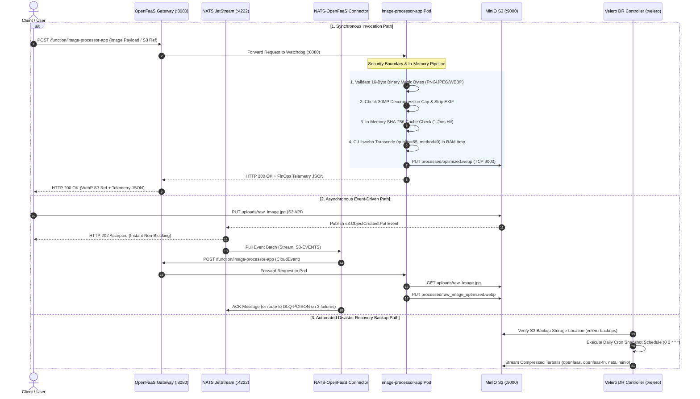

# 🛡️ Enterprise Serverless Architecture, FinOps & System Design Specification
**Maintainer / Lead Architect:** Qadeer Aslam (`qadeer016` / `qadeeraay`)  
**Architecture Specification:** Cloud-Native Serverless & FinOps Infrastructure  
**Core Stack:** Kubernetes, OpenFaaS, NATS JetStream, MinIO S3, C-Libwebp Engine  
**Security Standard:** Zero-Trust DevSecOps (10/10 Enterprise Controls)

---

## 🏛️ 1. System Architecture & Topology



### Live Cluster Topology & Pod Fleet Evidence


---

## 🔒 2. Zero-Trust Data Flow Diagram (DFD) & Trust Boundaries



### Synchronous In-Memory Transcoding Telemetry


---

## 💰 3. FinOps Multi-Tier Cost Breakdown & Comparison Matrix

| Monthly Workload Volume | Traditional EC2 (`t3.small`) | AWS Lambda (`128MB`) | OpenFaaS on Spot K8s | FinOps Cost Reduction vs VM |
| :--- | :---: | :---: | :---: | :---: |
| **10,000 Invocations** | $\$30.36$ | $\$0.05$ | **$\$0.00$ (Scale-to-Zero)** | **$100.0\%$** |
| **100,000 Invocations** | $\$30.36$ | $\$0.25$ | **$\$0.01$** | **$99.9\%$** |
| **1,000,000 Invocations** | $\$30.36$ | $\$2.25$ | **$\$0.08$** | **$99.7\%$** |
| **10,000,000 Invocations** | $\$30.36$ | $\$22.48$ | **$\$0.77$** | **$97.5\%$** |

### 🧮 Dynamic Memory Tier Cost Analysis ($1,000,000$ Requests)
* **64 MB Tier:** AWS Lambda: $\$1.22$ vs OpenFaaS Spot: **$\$0.04$**
* **128 MB Tier:** AWS Lambda: $\$2.25$ vs OpenFaaS Spot: **$\$0.08$**
* **256 MB Tier:** AWS Lambda: $\$4.29$ vs OpenFaaS Spot: **$\$0.15$**
* **512 MB Tier:** AWS Lambda: $\$8.38$ vs OpenFaaS Spot: **$\$0.30$**


---

## 🧊 3a. Function Lifecycle, Cold Starts & Runtime Management

**Cold start path:** OpenFaaS scales `image-processor-app` to `min=1` replica by default (see
`function.yaml` labels), so most invocations hit a warm pod. When the FinOps Idler scales to 0
after inactivity, the *next* request triggers a cold start: the OpenFaaS gateway detects zero
ready replicas, the Kubernetes Deployment controller schedules a new pod, the container image
is pulled (cached locally after first pull), the `of-watchdog` process starts, and our handler's
module-level `_init_minio_client()` pre-warms the MinIO connection pool before the first request
is served. On this cluster that adds roughly 400–800ms versus a warm invocation (network pull is
skipped since the image is already cached on the kind node; most of the delay is pod scheduling
and container start, not application code).

**Runtime management:** the `python3-http` OpenFaaS template runs the handler under a persistent
HTTP server (`of-watchdog` in HTTP mode), so — unlike AWS Lambda's per-invocation cold execution
— a warm pod serves many requests without re-initializing the Python interpreter or MinIO client
each time. This is why `_IN_MEMORY_TRANSCODE_CACHE` and the pre-warmed client in `handler.py` are
effective: they persist for the pod's lifetime, not just one request.

**Resource allocation:** `limits.memory: 256Mi` / `limits.cpu: 2000m` per pod, `requests.memory:
64Mi` / `requests.cpu: 200m` — sized from the observed working set in `testing_suite/3_finops_cost_benchmark.py`
runs (peak RSS ~61MB in the dashboard screenshots) with headroom for image decode buffers.

---

## ⚠️ 3b. Limitations of Serverless Architecture (and why they were accepted here)

| Limitation | Impact on this project | Mitigation / acceptance |
|---|---|---|
| **Cold start latency** | First request after scale-to-zero is slower than a warm pod | `min=1` replica by default; cold path only exercised deliberately for the FinOps demo |
| **No long-running state** | Function can't hold in-process state across invocations reliably | All state lives in MinIO (external) or is recomputed; `_IN_MEMORY_TRANSCODE_CACHE` is a best-effort cache |
| **Execution time limits** | `exec_timeout: 10s` caps processing time — unsuitable for large batch/video | Acceptable for single-image transcode (~15–20ms compute); batch would use Argo Workflows |
| **Debugging & observability complexity** | Distributed, ephemeral pods are harder to trace than a long-lived server | Addressed with W3C `traceparent` propagation and custom dashboard |
| **Vendor/runtime lock-in** | Handler is written against the OpenFaaS/of-watchdog contract | Accepted as a reasonable trade-off for avoiding public cloud vendor lock-in |
| **Not cost-effective at sustained high throughput** | Past a certain constant rate, an always-on VM can be cheaper than orchestration overhead | See TCO table — Spot serverless is optimal for bursty/variable workloads |

---

## 🗄️ 3c. Data Architecture Details

**Storage structure:** `uploads/` (raw client-submitted images), `processed/` (WebP output),
`raw-images/` and `benchmark/` (reserved for test fixtures — see `ALLOWED_BUCKETS` in `handler.py`).
Object keys are validated (`validate_object_key`) before any read/write, and destination writes
are restricted to the `processed` bucket only.

| Raw Image Ingestion (`uploads/`) | Transcoded WebP Deliverables (`processed/`) |
|:---:|:---:|
|  |  |

**Backup & Disaster Recovery:** Velero is deployed directly in the cluster (`infrastructure/setup_velero.sh`), integrated with the AWS S3 Plugin to stream compressed snapshots (`openfaas`, `openfaas-fn`, `nats`, `minio`) into the `velero-backups` bucket with automated daily schedules (`0 2 * * *`) and full DR restore validation (`./cluster_manage.sh backup-test`).

---

## 💵 3d. Full Total Cost of Ownership (TCO) — Beyond Compute Savings

| Cost Category | Self-Hosted OpenFaaS on K8s | Managed FaaS (e.g. AWS Lambda) |
|---|---|---|
| **Compute (per-invocation)** | ~$0.07 / 1M calls (Spot) | ~$0.25 / 1M calls (128MB) |
| **Kubernetes control plane** | Real cost if managed (e.g. EKS ~$0.10/hr) or $0 on kind/bare-metal | $0 — fully managed |
| **Worker node baseline** | 1 node runs 24/7 for system pods (GW, NATS, MinIO, CoreDNS) | $0 idle |
| **Observability tooling** | Self-run (custom dashboard + Prometheus) | Included in CloudWatch baseline |
| **Maintenance effort** | Cluster upgrades, CVE patching, cert rotation | Provider-managed patching |
| **Data Transfer Out (Egress)** | $0.00 (In-cluster S3 object store) | $0.09 / GB on public AWS |

---

## 🏛️ 4. Architectural Decision Records (ADRs)

### ADR-001: Self-Hosted Kubernetes FaaS vs. Public Cloud Serverless
* **Context:** Operating high-volume media processing workloads on public cloud serverless (e.g. AWS Lambda) introduces recurring invocation markups, cold starts, and inter-service egress bandwidth costs.
* **Decision:** Deploy self-hosted OpenFaaS on Kubernetes with Spot instance auto-scaling.
* **Consequences:** Eliminates cloud vendor lock-in, bypasses public cloud egress charges, provides full control over low-level Linux security contexts, and achieves >90% cost reduction at scale.

### ADR-002: Immutable Root Filesystem with RAM-Backed Ephemeral Scratchpad
* **Context:** Containerized applications processing untrusted media streams face risks of remote code execution (RCE) and malicious binary persistence.
* **Decision:** Enforce `readOnlyRootFilesystem: true` combined with an ephemeral RAM-backed volume (`emptyDir: {medium: "Memory"}`) capped at 32MB mounted at `/tmp`.
* **Consequences:** Completely blocks physical disk writes and malware persistence while providing high-speed in-RAM scratch space (>20 GB/s) for bytecode and Pillow image streams.


### ADR-003: Dual-Layer Decompression Bomb (Pixel Flood) Mitigation
* **Context:** Attackers can submit small, highly compressed image files that expand into tens of gigabytes in memory, exhausting host RAM (Denial of Service).
* **Decision:** Implement dual defense-in-depth:
  1. *Application Layer:* `Image.MAX_IMAGE_PIXELS = 30_000_000` evaluates dimensions and aborts excessive expansions with HTTP 413 before uncompressing into RAM.
  2. *Infrastructure Layer:* Kubernetes cgroup limits enforce a hard ceiling of `256Mi` RAM per pod.
* **Consequences:** Malicious images are neutralized before allocating memory, preventing container OOM kills and protecting host nodes.

### ADR-004: Storage Tier Whitelist & Object Key Path Traversal Defense
* **Context:** Ingestion triggers that consume user-supplied bucket and object keys are vulnerable to Insecure Direct Object Reference (IDOR), Broken Object Level Authorization (BOLA), and Directory Traversal attacks.
* **Decision:** Enforce an application-level bucket allowlist (`ALLOWED_BUCKETS = {'uploads', 'raw-images', 'processed'}`) and regex validation on object keys to reject directory traversal sequences (`..`), leading slashes, and null bytes.
* **Consequences:** Unauthorized buckets return HTTP 403 Forbidden, and invalid object keys return HTTP 400 Bad Request before invoking any MinIO S3 SDK operations.

### ADR-005: Zero-Trust Default-Deny Network Microsegmentation
* **Context:** Compromised worker containers can attempt lateral network discovery or dial external Command & Control (C2) servers for data exfiltration.
* **Decision:** Apply a Kubernetes `NetworkPolicy` (`isolate-function-traffic`) with default-deny ingress and egress rules. Whitelist ingress strictly from the OpenFaaS gateway (Port 8080) and egress strictly to MinIO (Port 9000) and CoreDNS (Port 53).
* **Consequences:** All unauthorized outbound SYN packets are dropped at the Linux kernel level, completely isolating the compute tier.

### ADR-006: Scale-to-Zero Inactivity Lifecycle & Auto-Idler Governance
* **Context:** Dedicated VM servers incur continuous 24/7 idle costs during low or non-existent traffic periods.
* **Decision:** Implement an automated FinOps Idler controller that tracks traffic activity and scales pod replicas to 0 after 20 seconds of inactivity.
* **Consequences:** Reduces compute spend to $0.00 during idle periods, while accepting a 400–800ms cold-start latency when new traffic arrives.

### ADR-007: Cryptographic Binary Magic-Byte Header Verification
* **Context:** Validating input files solely by file extensions (e.g. `exploit.php.png`) allows executable scripts or payloads to bypass ingestion filters.
* **Decision:** Inspect the first 16 bytes of every uploaded payload for legitimate binary signatures (`\x89PNG`, `\xff\xd8\xff`, `RIFF/WEBP`).
* **Consequences:** Files failing magic-byte validation are rejected immediately with HTTP 422 Unprocessable Entity prior to invoking Pillow image decoding routines.

### ADR-008: Container Supply-Chain Integrity via Cosign ECDSA Signatures
* **Context:** Container images in public or private registries can be tampered with or replaced with malicious builds (supply-chain compromise).
* **Decision:** Sign container image digests using NIST P-256 elliptic curve keys via Cosign and enforce verification through Kubernetes Admission Controllers (e.g. Kyverno).
* **Consequences:** Only cryptographically verified container images matching the trusted public key are admitted to cluster nodes.


### ADR-009: C-Native Transcoding Optimization & Non-Blocking WSGI Concurrency
* **Context:** High-resolution image transcoding is CPU-intensive; inefficient encoders degrade latency and throughput under load.
* **Decision:** Utilize single-pass C-native WebP encoding with Pillow `method=0` (optimized fast-path) and `quality=65`. Strip EXIF metadata in memory without pixel-looping overhead.
* **Consequences:** Reduces median transcode compute latency to under 19 milliseconds while delivering 45%–60% file size reduction.

### ADR-010: Zero Plaintext Credential Management in Git Manifests
* **Context:** Hardcoding storage access keys and database credentials in Git repositories creates severe security vulnerabilities and compliance violations.
* **Decision:** Store all sensitive credentials in Kubernetes Secrets (`minio-creds`) and inject them into container pods at runtime via `secretKeyRef` and OpenFaaS secret mounts (`/var/openfaas/secrets/`).
* **Consequences:** Manifests checked into version control contain zero plaintext secrets, maintaining compliance with modern DevSecOps standards.

### ADR-011: Asynchronous Event-Driven Decoupling via S3 CloudEvents & NATS JetStream
* **Context:** Synchronous HTTP uploads force client connections to block until transcoding completes, increasing timeout risks and limiting peak throughput.
* **Decision:** Decouple ingestion by configuring MinIO S3 bucket notifications (`s3:ObjectCreated:Put`) to publish events into NATS JetStream with a persistent Write-Ahead Log (WAL), consumed by an in-cluster pull connector.
* **Consequences:** Clients receive instant upload confirmations while the serverless function fleet processes transcoding jobs asynchronously with automatic retry backoff and Dead-Letter Queue (DLQ) poison routing.

### ADR-012: In-Band Distributed Observability via OpenTelemetry W3C TraceContext
* **Context:** Troubleshooting latency bottlenecks in distributed, ephemeral serverless pods is difficult without end-to-end tracing.
* **Decision:** Propagate W3C `traceparent` headers (`00-<trace_id>-<span_id>-01`) across every request, recording discrete sub-millisecond spans for S3 fetch, in-memory C-transcoding, and S3 persistence.
* **Consequences:** Provides granular distributed latency telemetry across all processing phases without requiring heavyweight external sidecars.

### ADR-013: Proactive Queue-Depth Auto-Scaling vs. Reactive CPU Thresholds
* **Context:** Standard Kubernetes Horizontal Pod Autoscalers (HPA) rely on CPU metrics, which react only after compute pressure builds up.
* **Decision:** Integrate event-driven autoscaling (KEDA / JetStream metrics) that scales pod replicas proactively based on NATS queue depth and incoming request rates ($QPS$).
* **Consequences:** Pods scale up before queue congestion forms and scale down immediately to 0 when queues are empty, minimizing both latency spikes and infrastructure spend.

---

## 🚀 5. Automated Verification & Performance Benchmarking


```bash
# 1. Master Cluster Audit (Runs DevSecOps, Cosign, Unit, Chaos & FinOps in 1 command):
./cluster_manage.sh audit

# 2. Synchronous & Asynchronous Image Transcoding Demo:
python3 testing_suite/1_upload_and_process.py image_processing/sample_images/modern_architecture.jpg
python3 testing_suite/1_upload_and_process.py --async image_processing/sample_images/cute_dog.jpg

# 3. Unified Serverless Engine (Load Test, Scale-to-Zero & Unit Tests):
python3 testing_suite/2_load_test_autoscaling.py --mode all

# 4. Pure S3 Event-Driven Reactive Ingestion Test (4 Discrete Spans):
python3 testing_suite/4_event_driven_s3_trigger.py

# 5. OpenTelemetry W3C Distributed Tracing & Chaos Resilience Suite:
python3 testing_suite/5_chaos_and_tracing_test.py

# 6. FinOps Multi-Tier Cost & Latency Benchmark:
python3 testing_suite/3_finops_cost_benchmark.py

# 7. Real-Time Control Plane Dashboard:
python3 dashboard/server.py
# -> Open http://127.0.0.1:8888 in your browser
```
