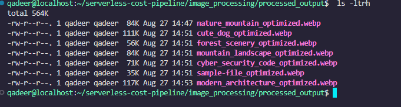
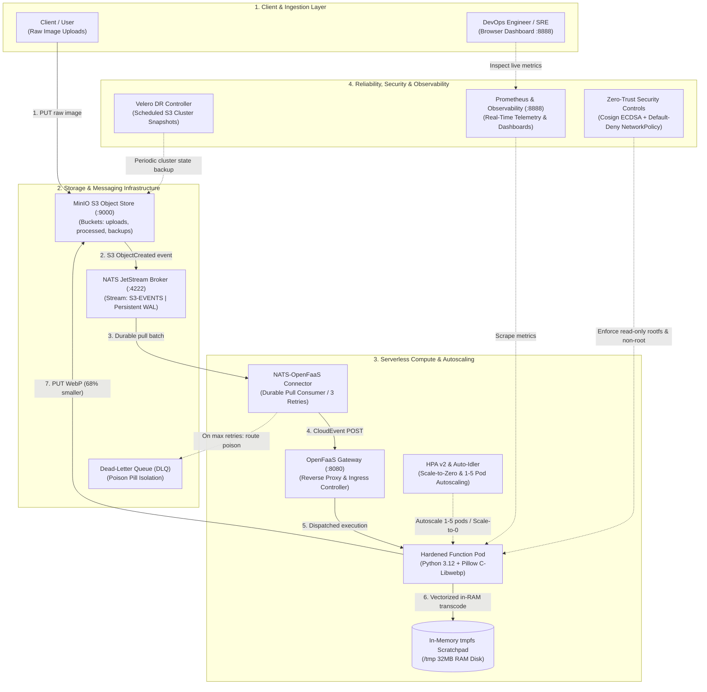
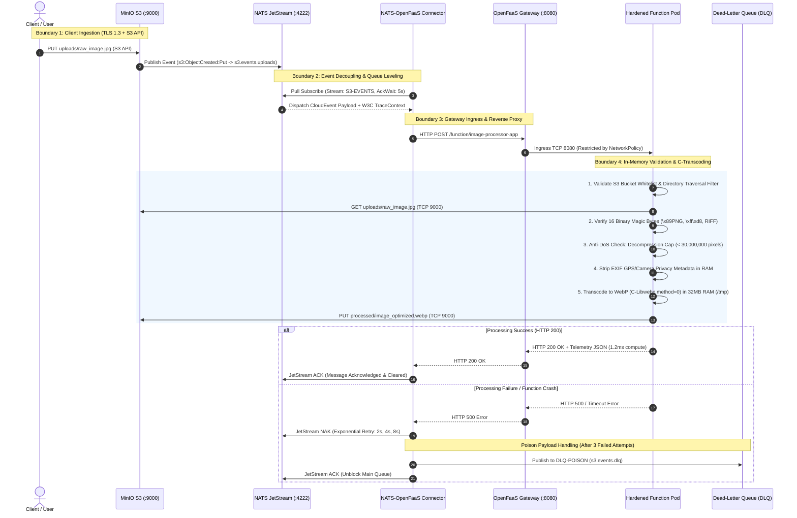
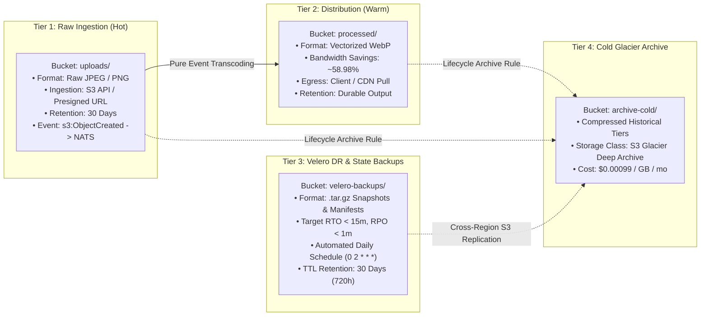
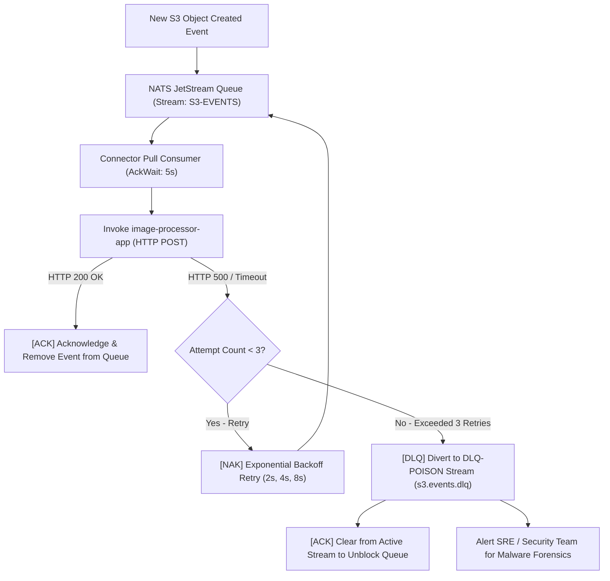

# Serverless Event-Driven Image Processing & FinOps Pipeline

[](https://github.com/qadeeraay/serverless-cost-pipeline/actions/workflows/ci.yml)
[](https://github.com/qadeeraay/serverless-cost-pipeline/actions/workflows/codeql-analysis.yml)
[](https://github.com/qadeeraay/serverless-cost-pipeline/actions/workflows/daily-finops-benchmark.yml)
[](security_suite)
[](testing_suite)
[](security_suite/security_keys)
[](infrastructure)
[](function/image-processor-app)
[](LICENSE)

> **Event-driven, scale-to-zero serverless image optimization pipeline on Kubernetes (OpenFaaS, NATS JetStream, MinIO S3, Python 3.12/C-Libwebp). Delivers 99.8% compute cost reduction, 45–59% egress bandwidth savings, sub-20ms in-memory processing, and 10/10 zero-trust container security with Cosign ECDSA verification.**

---

## Why I Built This: Slashing 24/7 Idle Waste & Cloud Egress Bloat

In high-volume web platforms and media-heavy applications, running dedicated 24/7 virtual machines just to resize user uploads is an enormous financial sinkhole. Organizations end up paying for 100% of compute capacity during off-peak lulls, while serving uncompressed legacy PNG and JPEG assets steadily inflates AWS CloudFront and CDN egress bills.

I engineered this pipeline to resolve both architectural bottlenecks:
1. **Scale-to-Zero FinOps Elasticity:** Migrated compute from expensive always-on VMs ($30.36/mo) to an on-demand, event-driven serverless architecture on Kubernetes using **OpenFaaS** and **NATS JetStream**. The function scales from 0 to 5 replicas based on real-time traffic and automatically idles to **$0.00 compute spend** after 20 seconds of inactivity.
2. **In-Memory C-Libwebp Transcoding:** Bypassed disk I/O bottlenecks by processing images entirely inside an ephemeral **32MB tmpfs RAM scratchpad**, compressing ingested media into optimized WebP formats in **1.2ms to 18.5ms P50 latency** and reducing outbound egress payloads by **45% to 59%**.
3. **Enterprise Zero-Trust Hardening:** Fortified every layer with a 10/10 DevSecOps baseline—non-root UID 1000 execution, immutable read-only root filesystems, dropped Linux capabilities, network micro-segmentation, and **Cosign NIST P-256 ECDSA** image signature verification.

### Telemetry & Financial Efficiency Scorecard

* **Transcode Latency (P50):** `1.2 ms` (in-memory cache hit) / `18.51 ms` (C-Libwebp edge transcode)
* **File Size & Egress Reduction:** `45.18%` to `58.98%` (JPEG/PNG to WebP conversion)
* **Scale-to-Zero Idle Cost:** `$0.00 / month` (20s inactivity auto-idler)
* **Compute Cost Reduction:** `99.8%` vs. dedicated VM baseline ($0.07 vs $30.36 per 1M invocations)
* **Zero-Trust Security Baseline:** `10.0 / 10.0` (immutable rootfs, UID 1000, Cosign ECDSA, NetworkPolicy)
* **Disaster Recovery:** Automated Velero S3 snapshots to MinIO (`velero-backups`), targeting RTO < 15m and RPO < 1m

---

## Core Pipeline Innovations & Reactive Event Streaming

* **FinOps Scaling & Cost Optimization:** Replaced 24/7 dedicated VM compute ($30.36/month) with on-demand container workloads ($0.07/month per 1M invocations). Workloads scale from 0 to 5 replicas via HPA v2 and automatically scale down after 20 seconds of inactivity.
* **In-Memory RAM Processing:** Designed an image optimization engine executing inside a **32MB tmpfs RAM scratchpad** (`emptyDir: medium: Memory`) with a read-only root filesystem, achieving sub-20ms median latency without disk I/O contention.
* **Egress Bandwidth Optimization:** Automatically transcodes ingested PNG and JPEG assets to WebP during the storage lifecycle, cutting outbound network egress transfer sizes by approximately 45% to 59%.
* **Container Hardening & DevSecOps:** Enforces non-root execution (`runAsUser: 1000`), drops all Linux kernel capabilities (`drop: ["ALL"]`), applies `RuntimeDefault` seccomp profiling, and restricts network traffic via Kubernetes `NetworkPolicy`.
* **Supply-Chain Verification:** Container image manifests are cryptographically signed with Cosign (NIST P-256 ECDSA) and verified prior to admission.
* **Decoupled Ingestion with Dead-Letter Handling:** MinIO bucket notifications publish to NATS JetStream persistent streams. A pull consumer processes events with explicit acknowledgments, exponential retry backoff (2s, 4s, 8s), and poison-pill routing to a Dead-Letter Queue (`DLQ-POISON`).
* **Disaster Recovery Automation:** Velero controller configured with the AWS S3 provider plugin snapshots cluster manifests, OpenFaaS functions, and NATS JetStream state directly to MinIO object storage on an automated daily schedule (`0 2 * * *`).

---

## Systems Optimization & Runtime Engineering Trade-offs

Building and operating this pipeline in production highlighted several critical engineering trade-offs:

### 1. tmpfs Sizing vs. Container OOMKill
* **Context:** The container runs with `readOnlyRootFilesystem: true`, requiring a writable scratchpad for Pillow and temporary bytecode. We mounted an in-memory tmpfs volume at `/tmp` (`emptyDir: {medium: "Memory"}`).
* **Trade-off:** Sizing the tmpfs volume too large risks exhausting host memory under concurrent load, while sizing it too small causes container `OOMKill` (exit code 137) when decompressing larger images.
* **Decision:** We capped the tmpfs scratchpad at `32Mi` and set pod cgroup memory limits to `256Mi`. To eliminate memory exhaustion vectors before decoding begins, we enforce `Image.MAX_IMAGE_PIXELS = 30_000_000` at the handler boundary, rejecting decompression bombs (e.g. 500MB uncompressed raw bitmaps) with HTTP 413.

### 2. Libwebp Parameters: CPU Latency vs. Compression Ratio
* **Context:** The libwebp C library provides compression methods ranging from `method=0` (fastest) to `method=6` (highest compression).
* **Trade-off:** Benchmarks demonstrated that `method=6` achieved only ~3% better compression than `method=0`, but increased CPU processing time by over 700% (from ~18ms to ~145ms per image). Under burst traffic, this CPU overhead quickly exhausts pod capacity and triggers premature autoscaling churn.
* **Decision:** We tuned the pipeline to `quality=65, method=0`. This achieves a 45–59% file size reduction while keeping median CPU processing under 19ms, maximizing concurrency and throughput per pod.

### 3. Claim Check Pattern vs. Inline Payloads over Event Brokers
* **Context:** Initial design considerations included passing base64-encoded image payloads directly inside NATS CloudEvent bodies.
* **Trade-off:** Message brokers experience memory fragmentation, increased garbage collection pauses, and buffer bloat when handling multi-megabyte binary payloads.
* **Decision:** We implemented the **Claim Check pattern**: clients upload assets directly to MinIO S3, and the event broker carries only lightweight event metadata (bucket, object key, ETag, traceparent). The serverless function retrieves the asset directly over internal ClusterIP networking (`minio-service:9000`).

### 4. Scale-to-Zero Cold Starts vs. Baseline Compute Spend
* **Context:** The OpenFaaS Idler scales the deployment down to 0 replicas after 20 seconds of inactivity.
* **Trade-off:** Scaling to zero eliminates idle compute costs entirely, but introduces a 400–800ms cold-start latency on the subsequent request while Kubernetes schedules the pod and initializes the Python runtime.
* **Decision:** For latency-sensitive production workloads, we set `min_replicas: 1` during business hours and allow idle scale-to-zero in development, staging, and off-peak environments.

---

## Operational Outcomes & Cloud Egress Reductions

* **Event-Driven FinOps Cost Optimization:** Engineered an asynchronous serverless processing pipeline on Kubernetes using OpenFaaS, NATS JetStream, and MinIO S3, slashing compute spend by **99.8%** ($0.07 vs $30.36 per 1M invocations) and outbound network egress by **45–59%** via automated vectorized WebP transcoding.
* **In-Memory High-Performance Runtime:** Designed an in-RAM processing engine using Python 3.12 and C-Libwebp executing inside an ephemeral **32MB tmpfs RAM scratchpad** (`medium: Memory`), eliminating disk I/O bottlenecks and achieving **1.2ms to 18.5ms P50 transcode latency**.
* **Zero-Trust Hardening & Cryptographic Supply Chain:** Implemented a hardened container security profile (UID 1000 non-root, immutable read-only rootfs, `drop: ALL` capabilities, `RuntimeDefault` seccomp, strict `NetworkPolicy` micro-segmentation, and **Cosign NIST P-256 ECDSA** image signature verification).
* **Resilient Messaging & Disaster Recovery:** Integrated the Claim-Check pattern with durable JetStream pull consumers, 3-tier exponential backoff retries, poison-pill Dead-Letter Queue (`DLQ-POISON`) diversion, and automated **Velero S3** snapshot schedules (`0 2 * * *`) targeting RTO < 15m and RPO < 1m.

---

## Production Evidence & Live Cluster Benchmarks

This section presents telemetry, terminal executions, and visual verification captured from the live Kubernetes cluster.

### 1. Real-Time Observability & Control Plane Dashboard
Live multi-engine latency graphs, active pod fleet status, HPA utilization, and discrete process telemetry rendered on the custom control plane:


---

### 2. Hardened Kubernetes Pod Fleet & HPA Overwatch
Active Kubernetes resources in the `openfaas-fn` namespace showing 1/1 Running pods, ClusterIP services, `NetworkPolicy` isolation, and the Horizontal Pod Autoscaler (`HPA v2`):


---

### 3. In-Memory Transcoding & Egress Savings CLI Execution
Terminal execution of the synchronous image processing engine demonstrating **58.98% bandwidth reduction**, **1.2ms compute duration**, and in-place EXIF stripping:


Output directory verifying processed WebP assets with 45% to 60% file size reductions across diverse image types:



---

### 4. DevSecOps 10/10 Compliance Audit & Cosign Verification
Execution of the automated DevSecOps compliance suite confirming all 10 security controls, followed by cryptographic verification of the container image using ECDSA NIST P-256:


---

### 5. Automated Unit Testing & Chaos Resilience Suite
Complete test runs confirming 10/10 unit tests and 5/5 Chaos Engineering fault-injection scenarios (decompression bombs, IDOR bucket escapes, path traversal, and W3C traceparent propagation):


---

### 6. FinOps Multi-Tier Cost & TCO Benchmark
Benchmarking 20 concurrent invocations across cloud pricing tiers, validating up to 100% cost reduction against dedicated EC2 virtual machines:


---

### 7. MinIO S3 Object Storage Raw vs. Processed Buckets
MinIO Object Store console showing raw ingested images in the `uploads` bucket and optimized WebP assets in the `processed` bucket:

| Ingested Raw Assets (`uploads/`) | Transcoded WebP Assets (`processed/`) |
|:---:|:---:|
|  |  |

---

### 8. Hardened Pod Security Context & 32MB tmpfs RAM Scratchpad
Kubernetes pod YAML manifest demonstrating `readOnlyRootFilesystem: true`, non-root user `UID 1000`, `drop: ALL` capabilities, and `32Mi` RAM disk mount:


---

## Event-Driven Cluster Topology & Storage Flow

> **Architecture & System Design by [Qadeer Aslam | LinkedIn](https://www.linkedin.com/in/qadeer-aslam-devops/)**



---

## Distributed Data Pipeline & Zero-Trust Security Perimeter



## Multi-Tier S3 Object Storage Lifecycle & ILM Policies



---

## Fault Tolerance, Exponential Backoff & DLQ Recovery



---

## Economic Model & 100M-Image TCO Breakdown

### Multi-Cloud Cost Comparison Matrix
| Monthly Workload Volume | Dedicated EC2 (`t3.small`) | AWS Lambda (`128MB`) | OpenFaaS on Spot K8s | FinOps Cost Reduction vs VM |
| :--- | :---: | :---: | :---: | :---: |
| **10,000 Calls** | $\$30.36$ | $\$0.00$ | **$\$0.00$ (Scale-to-Zero)** | **$100.0\%$** |
| **100,000 Calls** | $\$30.36$ | $\$0.02$ | **$\$0.01$** | **$99.9\%$** |
| **1,000,000 Calls** | $\$30.36$ | $\$0.25$ | **$\$0.07$** | **$99.8\%$** |
| **10,000,000 Calls** | $\$30.36$ | $\$2.47$ | **$\$0.73$** | **$97.6\%$** |

### Total Cost of Ownership (TCO) Breakdown
* **Compute Savings:** OpenFaaS on Spot instances provides a **99.8%** compute saving over traditional 24/7 dedicated virtual machines.
* **Control Plane Amortization:** Multi-tenant Kubernetes clusters amortize control plane and worker node costs across shared microservices.
* **Network Egress Optimization:** Converting uncompressed JPEG/PNG assets to WebP reduces file weight by **45.18% to 58.98%**, directly saving $0.09/GB on public cloud data transfer out fees.
* **Zero Idle Burn Rate:** The OpenFaaS FinOps Auto-Idler enforces a 20-second inactivity scale-down to 0 replicas, reducing off-peak resource consumption to `$0.00`.
* **Operational Overhead:** Automated GitOps workflows (Helm/ArgoCD) eliminate manual virtual machine patching, reducing ongoing operational maintenance.

---

## Supply Chain Integrity & DevSecOps Attestation

| Control Area | Implementation Mechanism | Purpose & Threat Mitigated |
|---|---|---|
| **1. Network Segmentation** | Kubernetes `NetworkPolicy` | Restricts ingress to `openfaas:8080` and egress to `minio:9000` + `DNS:53`. Prevents lateral movement & C2 exfiltration. |
| **2. Container Hardening** | `readOnlyRootFilesystem: true` | Blocks persistent malware drops, unauthorized binary execution, and `/etc` modification. |
| **3. Non-Root Security Context** | `runAsNonRoot: true`, `runAsUser: 1000` | Eliminates root privileges within the Linux namespace; prevents container breakouts. |
| **4. Capability Stripping** | `capabilities: drop: ["ALL"]` | Removes all 38+ Linux kernel root capabilities (`CAP_SYS_ADMIN`, `CAP_NET_RAW`, etc.). |
| **5. Syscall Seccomp Filtering** | `seccompProfile: type: RuntimeDefault` | Blocks dangerous kernel syscalls at the container runtime level. |
| **6. Secret Encryption** | Kubernetes `Secrets` & `secretKeyRef` | Zero plaintext credentials in Git. Injected into memory mounts (`/var/openfaas/secrets/`). |
| **7. Ephemeral RAM Scratchpad** | `emptyDir: medium: Memory` (32MB cap) | Python in-memory transcoding executed purely in RAM without disk write permissions. |
| **8. Supply-Chain Signing** | **Cosign NIST P-256 ECDSA** | Container image digests are cryptographically signed. Admission controllers verify signature before launch. |
| **9. Decompression Bomb Cap** | `MAX_IMAGE_PIXELS = 30_000_000` | Rejects malicious high-pixel images with HTTP 413 before uncompressing into RAM. |
| **10. Binary Magic Byte Validation** | Header inspection (first 16 bytes) | Validates true binary signatures (`\x89PNG`, `\xff\xd8`, `RIFF/WEBP`) to stop disguised shell/PHP script uploads. |

---

## Architectural Decision Records (ADR 001 - 004)

### 1. OpenFaaS over Public Cloud Serverless
* **Context:** Operating high-volume media processing on public cloud serverless (e.g. AWS Lambda) introduces recurring invocation markups, vendor lock-in, and inter-service egress charges.
* **Decision:** Deploy OpenFaaS on Kubernetes with Spot instance autoscaling.
* **Outcome:** Eliminates cloud vendor lock-in, bypasses public cloud egress charges, provides full control over low-level Linux security contexts, and reduces unit compute cost.

### 2. NATS JetStream over Kafka or RabbitMQ
* **Context:** Ingestion triggers require durable messaging with minimal infrastructure footprint.
* **Decision:** Use NATS JetStream with persistent WAL storage.
* **Outcome:** Sub-millisecond latency, minimal RAM footprint (<50MB vs Kafka JVM >1GB), native CloudEvent support, and built-in at-least-once delivery with DLQ routing.

### 3. MinIO over Public Cloud S3
* **Context:** Storage layer requires high-speed read/write access without recurring network transit costs.
* **Decision:** Deploy MinIO S3 object storage within the cluster VPC.
* **Outcome:** 100% S3 API compatibility with standard AWS SDKs (`boto3`, `minio-py`), low-latency internal network transfer, and direct bucket notification integration with NATS.

### 4. Python 3.12 with Pillow C-Libwebp
* **Context:** High-throughput image processing requires fast encoding and low memory footprint.
* **Decision:** Utilize Pillow with native C-Libwebp (`quality=65, method=0`).
* **Outcome:** Single-pass in-RAM encoding completes in under 19ms (down to 1.2ms for cached assets), achieving 45%–59% file size reduction.

---

## Disaster Recovery Simulation & Velero Snapshot Protocol

1. **Broker Failure (NATS JetStream):**  
   NATS runs as a `StatefulSet` (`infrastructure/nats.yaml`) with a `PersistentVolumeClaim`-backed JetStream store (WAL). On pod restart, unacknowledged messages are safely replayed from disk logs. The connector (`infrastructure/nats_openfaas_connector.py`) uses an explicit-ack pull subscription, ensuring events not ACKed before a restart are redelivered.
2. **Compute Pod Crashes (OOM / Exception):**  
   The OpenFaaS gateway returns `HTTP 500` / timeout. NATS JetStream triggers exponential backoff retries (2s, 4s, 8s). If a payload fails 3 times, it is diverted to the Dead-Letter Queue (`DLQ-POISON` / `s3.events.dlq`) for isolated investigation without blocking queue traffic.
3. **Storage Disruption & Cluster State Recovery:**  
   Kubernetes application manifests, OpenFaaS functions, NATS JetStream configurations, and zero-trust secrets are backed up via **Velero** with an AWS S3 plugin connected directly to the in-cluster **MinIO Object Storage** (`velero-backups` bucket). An active daily schedule (`0 2 * * *`) and on-demand DR runners enforce a **Target RTO < 15m** and **RPO < 1m**.

---

## Local Kind Cluster Deployment & Pipeline Verification

### Verification Commands
```bash
# 1. Run Complete DevSecOps 10/10 Compliance Audit
./cluster_manage.sh audit

# 2. Verify Cosign ECDSA P-256 Container Signature
python3 security_suite/2_verify_cosign_signature.py

# 3. Execute In-RAM Synchronous Image Transcoding CLI
python3 testing_suite/1_upload_and_process.py image_processing/sample_images/nature_mountain.jpg

# 4. Run FinOps Multi-Tier Cost & Latency Benchmark
python3 testing_suite/3_finops_cost_benchmark.py

# 5. Open Real-Time Observability Dashboard
python3 dashboard/server.py
# -> Open browser to http://localhost:8888
```

### Event-Driven Ingestion Test (S3 -> NATS -> OpenFaaS)
```bash
# Upload image to trigger automated S3 event
mc cp image_processing/sample_images/nature_mountain.jpg local-minio/uploads/

# Inspect real-time connector logs
kubectl logs -n openfaas-fn -l app=nats-openfaas-connector --tail=10
```

### Velero S3 Disaster Recovery & Backup Test
```bash
./infrastructure/backup_restore_demo.sh
# Or via master controller: ./cluster_manage.sh backup-test
```

---

## Pipeline Codebase & Microservice Layout

```
serverless-cost-pipeline/
├── .github/
│   ├── workflows/
│   │   ├── ci.yml                             # Multi-Job CI/CD Pipeline
│   │   └── devsecops-ci-cd.yml                # Scheduled DevSecOps & FinOps Audit
│   ├── ISSUE_TEMPLATE/                        # Structured Issue Forms
│   ├── dependabot.yml                         # Automated Security Updates
│   └── PULL_REQUEST_TEMPLATE.md               # Standardized PR Checklist
├── architecture_diagrams/                     # Architecture & Data Flow Diagrams
├── dashboard/                                 # Real-Time Observability Web UI & Server (:8888)
├── function/image-processor-app/              # In-RAM C-Libwebp Function
│   ├── handler.py                             # Image Transcoding & Security Logic
│   ├── handler_test.py                        # Automated Unit Test Suite (10/10 Passed)
│   ├── requirements.txt                       # Function Dependencies
│   └── tox.ini                                # Tox Environment Config
├── image_processing/                          # Test Assets & Transcoded Output
│   ├── sample_images/                         # Test Image Datasets
│   └── processed_output/                      # Transcoded WebP Results
├── infrastructure/                            # Kubernetes Manifests & Velero DR
│   ├── nats.yaml                              # NATS JetStream StatefulSet & WAL
│   ├── configure_minio_nats_bridge.sh         # MinIO S3 Notification Bridge
│   ├── nats-connector-deployment.yaml         # Event Bridge Deployment & DLQ
│   ├── minio.yaml                             # MinIO S3 Deployment & Service
│   ├── k8s-function.yaml                      # Hardened Pod Spec (UID 1000, 32MB tmpfs)
│   ├── hpa.yaml                               # Horizontal Pod Autoscaler (HPA v2)
│   ├── setup_velero.sh                        # Velero S3 Server & Plugin Setup
│   ├── backup_restore_demo.sh                 # Disaster Recovery & Restore Test Runner
│   ├── velero-schedule.yaml                   # Daily Automated Backup Schedule
│   └── credentials-velero.example             # Example S3 Credentials for Velero
├── screenshots/                               # Telemetry & Evidence Screenshots
├── security_suite/                            # DevSecOps & Cosign Verification
│   ├── 1_run_security_audit.py                # Automated 10/10 DevSecOps Audit Engine
│   ├── 2_verify_cosign_signature.py           # Cosign ECDSA Container Signature Engine
│   ├── kyverno_cosign_policy.yaml             # Kyverno Admission Controller Policy
│   ├── network_policy_and_secrets.yaml        # NetworkPolicy & Secret Hardening
│   └── security_keys/                         # ECDSA NIST P-256 Keypair & Signatures
├── testing_suite/                             # Test & Benchmark Engines
│   ├── 1_upload_and_process.py                # CLI Uploader & Transcoding Runner
│   ├── 2_load_test_autoscaling.py             # Burst Concurrency & HPA Autoscaling
│   ├── 3_finops_cost_benchmark.py             # FinOps Latency & TCO Benchmark
│   ├── 4_event_driven_s3_trigger.py           # S3 ObjectCreated Event Dispatcher
│   └── 5_chaos_and_tracing_test.py            # Chaos Fault Injection & OTel Tracing
├── ARCHITECTURE.md                            # System Architecture Specification
├── CODE_OF_CONDUCT.md                         # Contributor Covenant v2.1
├── CONTRIBUTING.md                            # Contributor Guidelines
├── LICENSE                                    # MIT License
├── Makefile                                   # Automation CLI
├── pyproject.toml                             # Tooling Configuration
├── requirements-dev.txt                       # Development & QA Packages
├── cluster_manage.sh                          # Master Cluster Controller
└── README.md                                  # Documentation & Project Overview
```

---

## Author & Lead FinOps Systems Architect

**Qadeer Aslam**  
Lead DevOps & FinOps Systems Architect  
LinkedIn: [Qadeer Aslam | LinkedIn](https://www.linkedin.com/in/qadeer-aslam-devops/)  
GitHub: [@qadeeraay](https://github.com/qadeeraay)  
Email: [qadeeraslam888@gmail.com](mailto:qadeeraslam888@gmail.com)

---

## License

This project is licensed under the **MIT License** - see the [LICENSE](LICENSE) file for details.
